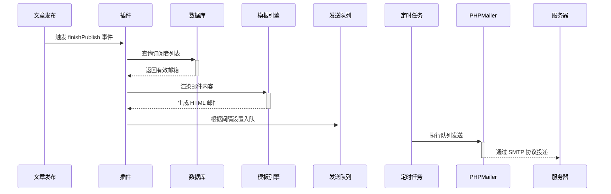

# Typecho-MailPulse
邮件推送订阅插件

## 功能介绍：
- 订阅推送：支持他人提供邮箱订阅文章更新，用户将邮箱填于插件设置，发布新文章时按设置推送给对应邮箱。
- SMTP设置：可在插件中对SMTP进行相关设置。
- 推送间隔：能自定义推送时间间隔，设为0则立即推送。
- 邮件设置：涵盖推送邮件设置与邮件模板设置，模板初始为默认，可在插件中修改。
- 推荐文章：可选择是否推送推荐文章内容，能填写推荐文章的cid。

## 结构：
/usr/plugins/MailPulse/
├── Plugin.php             # 主逻辑
├── cron.php               # 定时任务脚本
├── templates/
│   └── default.html       # 邮件模板
├── lib/
│   └── PHPMailer/         # PHPMailer库
├── queue.json             # 自动生成的队列文件
└── mailpulse.log          # 自动生成的日志文件

## 运行：

