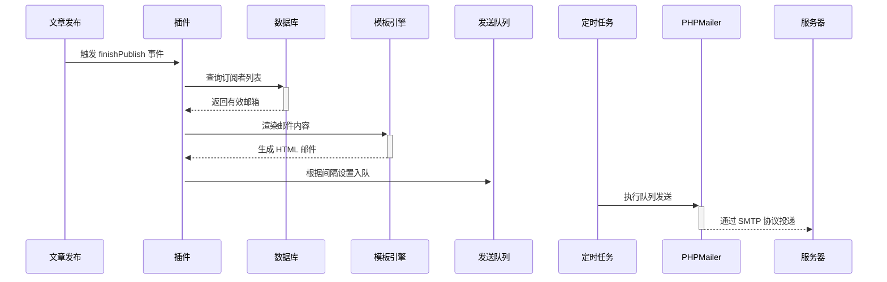

# Typecho-MailPulse
邮件推送订阅插件

MailPulse文件夹

感谢[deepseek](https://www.deepseek.com/)和项目[visamz/CommentToMail](https://github.com/visamz/CommentToMail)的PHPMailer

### MailPulse 插件使用教程与功能介绍

#### 插件简介

MailPulse 是一款用于 Typecho 博客的邮件推送订阅插件，旨在通过电子邮件通知订阅用户有关新文章发布的信息。该插件允许用户配置 SMTP 服务器设置，以便顺利发送电子邮件，同时支持基本的邮件模板定制。

模版推荐：
```html
<!DOCTYPE html>
<html lang="zh-CN">
<head>
    <meta charset="UTF-8">
    <meta name="viewport" content="width=device-width, initial-scale=1.0">
    <title>邮件通知</title>
    <style>
        body {
            margin: 0;
            padding: 0;
        }
        .container {
            max-width: 600px;
            margin: 0 auto;
            padding: 20px;
        }
        .day {
            background-color: #ffffff;
            border: 1px solid #dddddd;
            border-radius: 8px;
            padding: 20px;
        }
        .day h2 {
            color: #333333;
        }
        .day p {
            color: #555555;
        }
    </style>
</head>
<body>

    <!-- 邮件容器 -->
    <div class="container">
        <div class="day">
            <h2>新文章发布: {{title}}</h2>
            <p>博客: <a href="https://www.hansjack.com/" target="_blank" style="color:#0e70df; text-decoration: none;">时光流·言</a></p>
            <p>文章摘录: <span>{{excerpt}}</span></p>
            <p>作者: <span><a href="https://www.hansjack.com/" target="_blank" style="color:#0e70df; text-decoration: none;">HansJack</a></span></p>
<p style="font-size: 12px; color: #999;">本邮件由系统自动发送，请勿直接回复。</p>
        </div>
    </div>
</body>
</html>


```

#### 插件功能

1. **文章发布通知**：
   - 当您在 Typecho 中发布新文章时，插件会自动向配置的邮箱地址发送通知邮件，告知用户最新文章的标题、链接及摘录。

2. **SMTP 配置**：
   - 提供方便的 SMTP 设置界面，用户可以填写服务器地址、端口、用户名和密码，确保邮件能够成功投递。

3. **邮件模板**：
   - 用户可以自定义邮件内容模板，使用特定变量（如文章标题、链接、摘录和作者）对邮件进行个性化设置。

4. **订阅者管理**：
   - 插件在数据库中创建相应的表格，存储订阅者信息，包括邮件地址、状态和创建时间，以便后续管理与使用。

5. **日志记录**：
   - 插件内置日志记录功能，有助于用户追踪邮件发送状态和错误信息。

#### 安装与配置步骤

1. **下载与安装**：
   - 从插件市场或项目页面下载 `MailPulse` 插件。
   - 将下载的插件文件夹上传至 Typecho 的 plugins 目录下，重命名为 `MailPulse`。

2. **激活插件**：
   - 在 Typecho 后台管理界面，访问插件管理页面。
   - 找到 "MailPulse" 插件，点击激活。

3. **配置 SMTP 参数**：
   - 在插件设置页面，输入所需的 SMTP 配置（如 SMTP 服务器、端口、用户名和密码）。
   - 完成后保存设置。

4. **设置邮件模板**：
   - 在同一设置页面，您可以根据需要调整邮件的内容模板。
   - 使用提供的变量格式化邮件内容，如 `{{title}}` 和 `{{url}}`。

5. **配置接收通知的邮箱**：
   - 输入要接收通知的邮箱地址，多个邮箱以逗号分隔。
   - 确保这些邮箱是有效的，并能接收外部邮件。

6. **发布文章**：
   - 每当您发布新的文章时，系统会自动向配置的邮箱发送通知。
   - 检查您的邮箱，以确保收到文章发布的通知邮件。

#### 注意事项

- **防火墙设置**：确保您的服务器能够连接到 SMTP 服务器，检查防火墙配置可能会影响邮件发送。
- **邮箱验证**：有些 SMTP 服务提供商可能要求验证邮件地址，确保使用合法账户进行发送。
- **调试日志**：如果邮件发送失败，可以查看插件生成的日志文件（`mailpulse.log`），以帮助诊断问题。

#### 总结

MailPulse 插件提供了一种简便的方式来通知用户有关新文章的发布，增强用户的阅读体验。通过灵活的模板和 SMTP 配置，您可以方便地管理邮件通知，并保持与用户的联系。如果您在使用过程中遇到问题，您可以参考日志文件以获取更多信息。

如有任何问题或需要进一步支持，请随时在社区中寻求帮助或联系开发者。


## 功能介绍：
- 订阅推送：支持他人提供邮箱订阅文章更新，用户将邮箱填于插件设置，发布新文章时按设置推送给对应邮箱。
- SMTP设置：可在插件中对SMTP进行相关设置。
- 推送间隔：能自定义推送时间间隔，设为0则立即推送。
- 邮件设置：涵盖推送邮件设置与邮件模板设置，模板初始为默认，可在插件中修改。
- 推荐文章：可选择是否推送推荐文章内容，能填写推荐文章的cid。


## 结构：
- /usr/plugins/MailPulse/
- ├── Plugin.php             # 主逻辑
- ├── cron.php               # 定时任务脚本
- ├── templates/
- │   └── default.html       # 邮件模板
- ├── lib/
- │   └── PHPMailer/         # PHPMailer库
- ├── queue.json             # 自动生成的队列文件
- └── mailpulse.log          # 自动生成的日志文件

## 运行：

